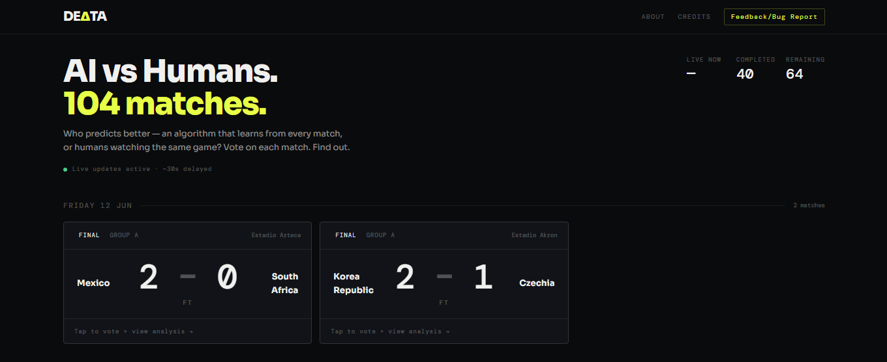

<p align="center">
  
</p>

<h1 align="center">DEΔTA26</h1>

<p align="center">
<strong>An AI that experienced the World Cup in real time.</strong>
</p>

<p align="center">
<i>An autonomous system that predicted all 104 matches of the FIFA World Cup 2026, retraining after every completed game.</i>
</p>

<p align="center">
Built live during the tournament (June 11 – July 19, 2026).<br>
<strong>Project complete. Backend and database now decommissioned.</strong>
</p>

<p align="center">
  <a href="https://delta26.vercel.app">
    
  </a>
</p>

<p align="center">


</p>

---

## Home

<p align="center">
  
</p>

---

## What was this?

Delta26 was a live prediction system that ran across all 104 FIFA World Cup 2026 matches. Before each match it published a prediction; after each match, it retrained on the result before the next kickoff. Published predictions were never rewritten by later retraining — only future matches were affected.

A companion voting feature let visitors compete against the AI's predictions. It saw fewer than 20 votes across the entire tournament — a real, documented result in its own right, and one of the case study's honest lessons.

The full engineering breakdown — architecture, results, what worked, what didn't, and what was learned — is written up as a case study here: **[delta26.vercel.app](https://delta26.vercel.app)**

---

## Results

| Metric | Value |
|---|---|
| Matches predicted | 104 |
| Tournament duration | 39 days |
| Live tournament accuracy | 46.2% (48/104 correct) |
| Peak validation accuracy | 68.4% (after Round of 16) |
| Final model validation accuracy | 61.9% |
| Model versions shipped | 8 |

---

## How it worked

```text
Internet → Live Data Collection → Validation → Feature Engineering
        → Prediction Engine (Dixon-Coles + Monte Carlo + XGBoost)
        → Groq Analysis → Database → FastAPI → Next.js
```

---

## System Components

### Data Layer
- Six confirmed live-score sources, async parallel fetch
- Search-API fallback (Tavily) from the quarter-finals onward, after JavaScript rendering made HTML scraping unreliable

### Parsing Layer
- Raw content parsed with Groq (llama-3.1-8b-instant)
- Pydantic v2 schema validation and hallucination guards

### Prediction Model
- Dixon-Coles statistical model
- Monte Carlo simulation (10,000 runs per match)
- XGBoost classifier, 24 contextual features
- Retrained after every completed match, chronological train/test split

### Voting System
- Browser fingerprinting, trust scoring, 85-minute lock
- Real infrastructure, minimal real-world adoption — documented as a lesson, not hidden

### Live Updates
- Server-Sent Events (SSE) for real-time score and prediction streaming

---

## Technology Stack

| Layer | Technology |
|---|---|
| Frontend (original) | Next.js 15, React 19, TypeScript, Tailwind CSS |
| Archive site | Static HTML/CSS/JS (no framework, no backend) |
| Backend | FastAPI, Python 3.11, SQLAlchemy |
| Database | Supabase PostgreSQL *(decommissioned)* |
| LLM | Groq — llama-3.1-8b-instant (parsing) + llama-3.3-70b-versatile (analysis) |
| ML | XGBoost + Dixon-Coles + Monte Carlo |
| Infrastructure (during tournament) | Vercel (frontend) + Render (backend, decommissioned) |

---

## Project Structure

```text
delta26/
├── backend/           # Original prediction pipeline (Python/FastAPI) — reference only, not runnable
├── frontend/           # Original Next.js app used during the live tournament
├── archive-site/       # Static case study page, live at delta26.vercel.app
└── archive-data/       # Exported match and prediction data (CSV)
```

---

## Project Status: Archived

The tournament ended July 19, 2026. The backend and database have since been decommissioned and API keys rotated. `backend/` and `frontend/` remain in this repo as a record of the actual engineering work — they are not intended to be run, since the live data sources, database, and credentials behind them no longer exist.

The current, permanent version of this project is the static case study at **[delta26.vercel.app](https://delta26.vercel.app)**.

---

## Disclaimer

This is an independent research and engineering project and is not affiliated with, endorsed by, or sponsored by FIFA, UEFA, or any football governing body.

Delta26 does not facilitate gambling, betting, prizes, or real-money activities.

All match information, statistics, and commentary were obtained from publicly available sources and used for educational, research, and experimental purposes only.

---

<p align="center">
<strong>39 days. 104 matches. One continuously learning system.</strong><br>
Archived · FIFA World Cup 2026
</p>