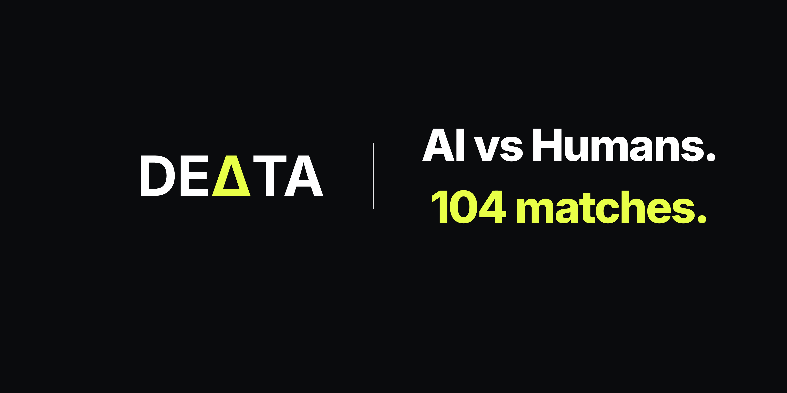
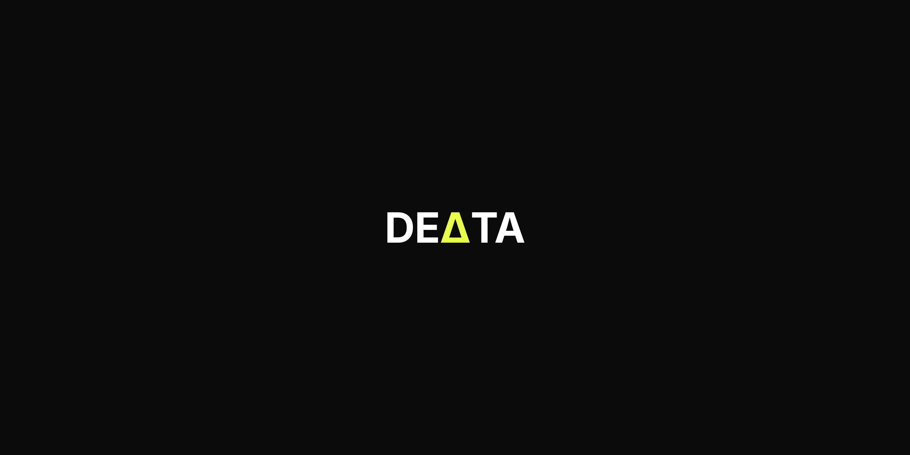

<p align="center">
  
</p>

<p align="center">
  
</p>

<h1 align="center">DEΔTA</h1>

<p align="center">
<strong>An AI that experiences the World Cup in real time.</strong>
</p>

<p align="center">
<i>Who predicts better — a machine that learns from every match, or humans watching the same game?</i>
</p>

<p align="center">
Currently being built during FIFA World Cup 2026.<br>
App is in active development.
</p>

<p align="center">
  <a href="https://delta26.vercel.app">
    
  </a>
</p>

<p align="center">


</p>

---

## Home

<p align="center">
  
</p>

<p align="center">
<i>AI vs Humans. 104 Matches.</i>
</p>

---

## What is this?

DEΔTA is a live prediction system running across all 104 FIFA World Cup 2026 matches.

After every match, the AI model retrains on the new result. Humans vote on each match before and during the game. The gap between the two — who is right, who is wrong, and when — is the central experiment.

The project combines statistical modelling, machine learning, live data pipelines, and AI-generated analysis into a single end-to-end system built during the tournament itself.

---

## How it works

```text
18 live sources → async parallel fetch → Groq LLM parsing
                                   ↓
                            prediction model
                                   ↓
                              SSE stream
                                   ↓
                                browser
                                   ↑
                      retrains after every match
```

---

## System Components

### Data Layer

* 18 sources split into 6 rotating groups
* Each match receives its own source group
* Async parallel fetching
* Rate limiting and automatic retry mechanisms
* Search fallback using Tavily and Linkup when sources fail

### Parsing Layer

* Raw commentary and web content parsed using Groq
* Structured JSON extraction
* Pydantic v2 schema validation
* Hallucination guards and output verification

### Prediction Model

* Dixon-Coles statistical model
* Monte Carlo simulations (10,000 runs)
* XGBoost with contextual football features
* Continuous retraining after completed matches

### Voting System

* One vote per match per browser fingerprint
* Voting locks at 85 minutes
* Human predictions tracked alongside AI predictions

### Live Updates

* Server-Sent Events (SSE)
* Incremental component updates
* Real-time score and prediction streaming

---

## Technology Stack

| Layer           | Technology                                               |
| --------------- | -------------------------------------------------------- |
| Frontend        | Next.js 15, React 19, TypeScript, Tailwind CSS           |
| Backend         | FastAPI, Python 3.11, SQLAlchemy                         |
| Database        | PostgreSQL (Render) + Google Sheets archive              |
| LLM             | Groq — llama-3.1-8b (parsing) + llama-3.3-70b (analysis) |
| ML              | XGBoost + Dixon-Coles + Monte Carlo                      |
| MLOps           | MLflow + DVC *(upcoming)*                                |
| Infrastructure  | Vercel (frontend) + Render (backend)                     |
| Search Fallback | Tavily + Linkup                                          |
| Bot Protection  | Cloudflare Turnstile + reCAPTCHA v3 *(upcoming)*         |
| Alerts          | Telegram Bot                                             |

**Total infrastructure cost: $0/month**

---

## Project Structure

```text
delta26/
├── assets/
│   ├── banner.png
│   ├── home.png
│   └── logo.png
│
├── backend/
│   ├── main.py          # FastAPI — routes, SSE, admin
│   ├── fetcher.py       # Async parallel multi-source fetch
│   ├── parser.py        # Groq parsing + validation
│   ├── model.py         # Dixon-Coles + Monte Carlo + XGBoost
│   ├── pipeline.py      # Orchestrator + state management
│   ├── alerts.py        # Telegram bot alerts
│   ├── sheets.py        # Google Sheets archive
│   ├── fixtures.py      # All 104 match definitions
│   └── health_check.py  # Pre-deploy verification
│
└── frontend/
    ├── src/app/         # Next.js App Router pages
    ├── src/components/  # Match cards, voting, live score
    ├── src/hooks/       # SSE connection, fingerprinting
    └── src/lib/         # API client and state management
```

---

## Build Status

| Component          | Status         |
| ------------------ | -------------- |
| Backend API        | ✅ Live         |
| Frontend           | ✅ Deployed     |
| Database           | ✅ Connected    |
| Match Cards        | ✅ Completed |
| Live Data Pipeline | ✅ Connected    |
| ML Model           | ✅ Updating Live |
| Voting System      | ✅ Live |

Tournament: **June 11 – July 19, 2026**
Matches: **104**
Teams: **48**

---

## Running Locally

```bash
git clone https://github.com/AryaBuwa/delta26.git
cd delta26
pip install -r requirements.txt
uvicorn backend.main:app --reload
```

API documentation:

```text
http://localhost:8000/docs
```

---

## Disclaimer

This is an independent research and engineering project and is not affiliated with, endorsed by, or sponsored by FIFA, UEFA, or any football governing body.

DEΔTA does not facilitate gambling, betting, prizes, or real-money activities.

All match information, statistics, and commentary are obtained from publicly available sources and are used for educational, research, and experimental purposes only.

---

<p align="center">
<strong>AI vs Humans. 104 Matches.</strong><br>
Built live during the FIFA World Cup 2026.
</p>
